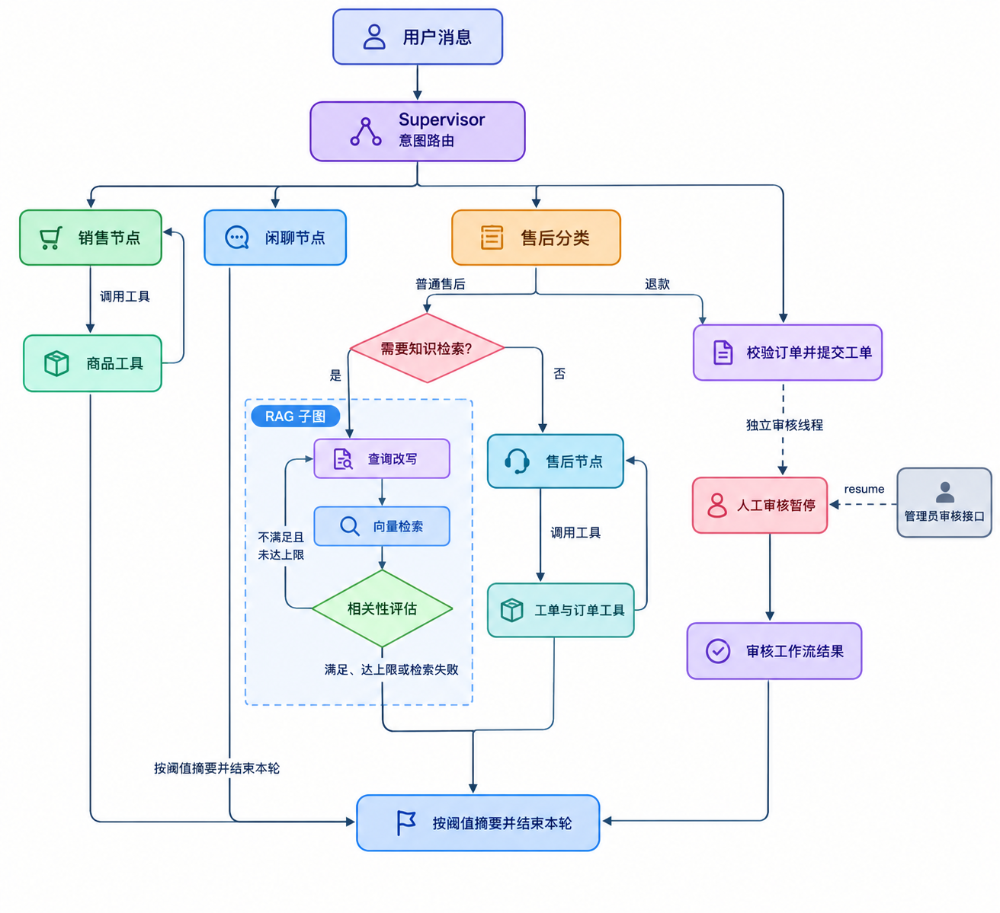
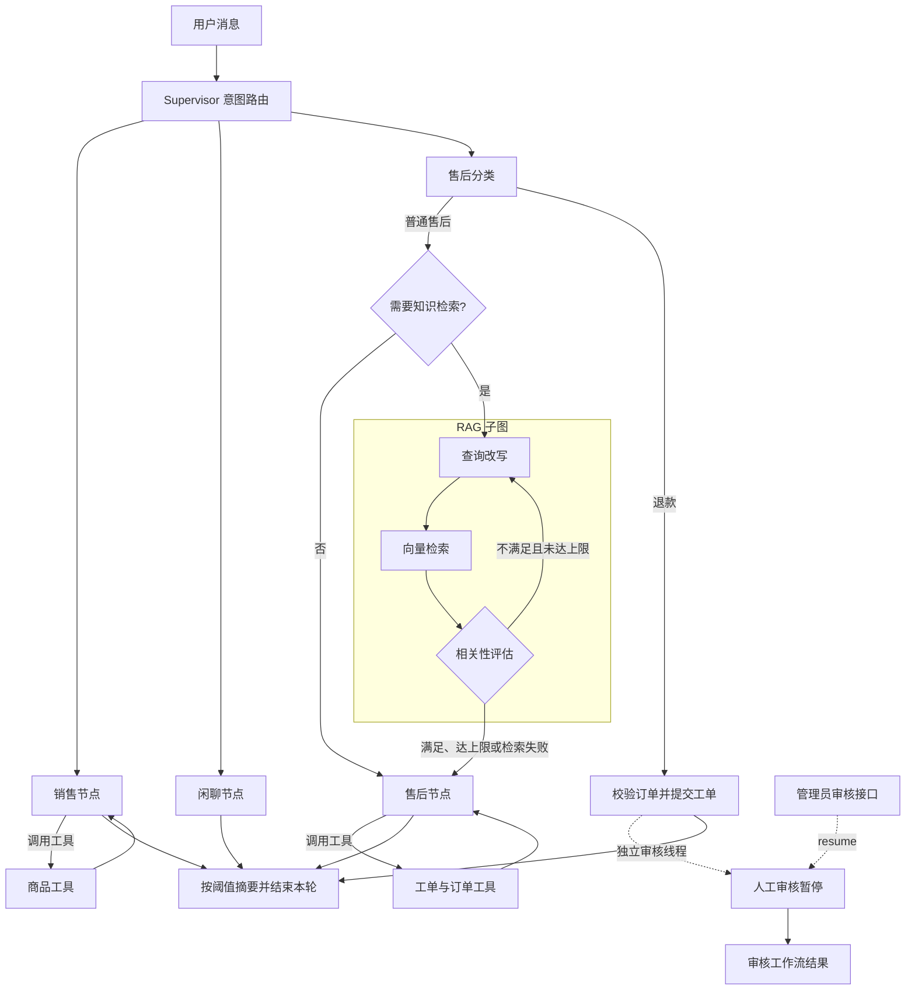

# SCRM AI 客服

基于 **LangGraph** 的多场景智能客服系统，结合 **RAG 知识检索、业务工具调用、持久化会话与人工退款审核**，覆盖销售导购、日常对话和售后服务。

LangGraph 负责状态与流程编排，RAG 提供售后知识检索，FastAPI 和 CLI 提供交互入口。

## 核心工程能力

### LangGraph 流程编排

- 使用 `StateGraph` 和条件路由组织销售、闲聊、售后流程，售后进一步区分普通咨询与退款申请。
- 销售与售后节点分别绑定业务工具，由 `ToolNode` 执行并返回模型，形成“模型决策 → 工具执行 → 继续回答”的循环。
- 商品、库存、促销、订单、物流和工单通过 MySQL Repository 访问；用户相关工具从图状态获取身份，而非让模型填写 `user_id`。

### RAG 检索子图与知识入库

- 普通售后先判断是否需要知识检索，再进入“查询改写 → 向量检索 → 相关性评估”子图。
- 结果不满足要求时继续改写，最多执行 3 轮改写与检索；达到上限或检索失败时退出，避免无限循环。
- 使用 Google Gemini Embedding 与 Chroma，支持 TXT/PDF 加载、文本分块、相关度过滤及来源文件、页码元数据。
- 按文件摘要增量入库：未变更文件跳过，更新文件替换过期分块，删除文件在下次导入时同步清理向量。
- 知识库故障与未检索到相关资料分开处理，不回退到静态关键词匹配。

### 持久状态与双层记忆

- PostgreSQL `AsyncPostgresSaver` 保存图状态，以 `conversation_id` 作为 `thread_id` 跨请求、跨重启恢复。
- 每轮只提交新消息；结合长期摘要和近期完整消息控制上下文，压缩阈值与保留轮次由配置管理。
- 会话归属表校验用户访问权限，同会话请求通过进程内锁串行执行。

### 人工介入与工程支撑

- 退款申请进入独立审核工作流，通过 `interrupt` 暂停，再由管理员接口使用 `Command(resume=...)` 恢复；等待期间主会话仍可继续。
- `ChatService` 复用于 CLI 与 FastAPI；应用生命周期统一创建和释放连接池、Repository 与服务。
- LangChain Callback 记录模型与工具调用耗时、状态及可用 Token 用量，使用请求标识关联智能体日志。
- API 提供 JWT 鉴权、刷新令牌轮换、登录失败限流和 HTTP 请求监控；假模型与假仓库支持本地回归测试。

## 工作流概览



 
<details>
<summary>展开 Mermaid 工作流图</summary>



</details>

## 快速启动

### 1. 准备环境

需要 Python 3.13、可用的 PostgreSQL 与 MySQL，以及 DeepSeek API Key；使用 RAG 还需 Google API Key。依赖版本以 `requirements.txt` 为准。

在项目根目录执行以下 PowerShell 命令；已有虚拟环境或 `backend/.env` 时跳过对应创建步骤，避免覆盖现有配置。

```powershell
python -m venv .venv
.\.venv\Scripts\Activate.ps1
python -m pip install -r requirements.txt
Copy-Item .env.example backend/.env
```

编辑 `backend/.env`，至少配置 `DEEPSEEK_API_KEY`、`POSTGRES_DSN` 和 `MYSQL_DSN`；RAG 配置 `GOOGLE_API_KEY`。`MYSQL_DSN` 使用 `mysql+asyncmy://`，连接密码中的 URL 特殊字符需编码。其他参数见 `.env.example`。

### 2. 初始化数据库与登录用户

提前创建两个数据库，并确保连接账号具有所需权限：PostgreSQL 首次启动需建表与建索引权限，MySQL 需支持业务和认证数据读写。

在 MySQL 客户端选中新建的业务数据库，依次执行：

1. `backend/sql/mysql/001_schema.sql`：业务表，已包含退款审核字段。
2. `backend/sql/mysql/002_seed_demo.sql`：演示用户、商品、订单和工单。
3. `backend/sql/mysql/003_auth.sql`：认证与刷新令牌表。

已有旧库需先核对退款字段与索引，参考 `backend/sql/mysql/004_refund_workflow.sql` 按实际数据库版本迁移；新库无需重复添加。PostgreSQL 会话表与 Checkpointer 表由程序启动时初始化。

为演示用户设置登录密码（项目没有默认密码）：

```powershell
python set_password.py cli-user
```

### 3. 导入知识库并启动

将 TXT/PDF 放入 `backend/app/data/knowledge/`，项目已附带售后演示文档。使用 RAG 时执行：

```powershell
python ingest_rag.py
```

向量数据保存在 `backend/app/chroma_db/`，增量清单保存在知识目录的 `.ingested.json`；未提前导入时，首次知识检索也会按需初始化。

```powershell
python run_api.py
```

默认地址为 `http://127.0.0.1:8000`，首页提供登录与聊天，Swagger 文档位于 `/docs`。在 Swagger 点击 `Authorize`，使用已有用户的 `user_id` 与密码授权；接口路径和参数以文档为准。

CLI 入口为 `python main.py`，默认使用 `cli-user` / `cli-default`；输入 `exit` 或 `quit` 退出。API 调用方需保存返回的 `conversation_id`，后续请求继续传入以恢复同一会话。

## 代码导航

以下路径相对 `backend/app/`：

- `agent/agent_config/graph.py`：LangGraph 主图、条件路由与工具循环。
- `agent/agent_config/son_rag_graph.py`、`agent/nodes/Rag_agent_node.py`：RAG 子图与改写、检索、评估节点。
- `rag/vector_store.py`、`knowledge/`：知识入库、向量检索及知识服务封装。
- `agent/memory.py`、`agent/nodes/summarize_node.py`：上下文组织与历史摘要。
- `agent/refund_workflow.py`：人工审核暂停与恢复。
- `chat/`、`conversation/`：共享运行时、聊天服务与会话归属持久化。
- `product/`、`order/`、`ticket/`、`user/`：业务服务与 Repository。
- `api/routers/`：认证、聊天、会话、管理员、系统和网页六组路由；`api/routes.py` 汇总注册，`api/dependencies.py` 管理共享依赖，`api/schemas.py` 管理请求与响应模型。
- `auth/`、`middleware/`：认证服务与智能体调用监控。
- `config/agent.yaml`、`config/chroma.yaml`：记忆策略、知识目录及分块检索参数。

 
